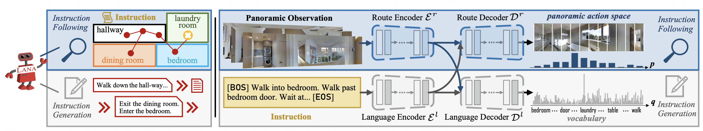

# LANA: a language-capable navigator for vision-language navigation.
This repository is the official implementation of [LANA: a language-capable navigator for vision-language navigation, CVPR2023](https://arxiv.org/abs/2303.08409).

Recently, visual-language navigation (VLN) -- entailing robot agents to follow navigation instructions -- has shown great advance. However, existing literature put most emphasis on interpreting instructions into actions, only delivering "dumb" wayfinding agents. In this article, we devise LANA, a language-capable navigation agent which is able to not only execute human-written navigation commands, but also provide route descriptions to humans. This is achieved by simultaneously learning instruction following and generation with only one single model. More specifically, two encoders, respectively for route and language encoding, are built and shared by two decoders, respectively, for action prediction and instruction generation, so as to exploit cross-task knowledge and capture task-specific characteristics. Throughout pretraining and fine-tuning, both instruction following and generation are set as optimization objectives. We empirically verify that, compared with recent advanced task-specific solutions, LANA attains better performances on both instruction following and route description, with nearly half complexity. In addition, endowed with language generation capability, LANA can explain to humans its behaviors and assist human's wayfinding. This work is expected to foster future efforts towards building more trustworthy and socially-intelligent navigation robots.




## Progress
- [x] Code for R2R & R4R Finetuning
- [ ] Code for R2R Pretraining
- [ ] Code for Reverie Pretraining and Finetuning


## Installation
1. Install [Matterport3D Simulator](https://github.com/peteanderson80/Matterport3DSimulator). 
```
git clone --recursive https://github.com/peteanderson80/Matterport3DSimulator.git
cd Matterport3DSimulator
git submodule update --init --recursive
```
Then build and compile `MatterSim`:
```
apt-get update
apt-get install -y wget doxygen curl libjsoncpp-dev libepoxy-dev libglm-dev libosmesa6 libosmesa6-dev libglew-dev libopencv-dev python-opencv
cd Matterport3DSimulator
mkdir build && cd build
cmake -DEGL_RENDERING=ON .. 
# If raise an error: Could NOT find OpenGL, then: apt-get install libgl1-mesa-dev
# If raise an error: Could NOT find OpenGL (missing: EGL), the: apt-get install libegl1-mesa-dev
# Or if still facing unexpected error, you can try: cmake -DOSMESA_RENDERING=ON ..
make -j8
export PYTHONPATH=Matterport3DSimulator/build:$PYTHONPATH
```
Or build using Docker [(instruction)](https://github.com/peteanderson80/Matterport3DSimulator#building-using-docker).

After this step, `import MatterSim` in Python will not raise ImportError.


2. Setup with Anaconda and pip to install prerequisites:
```
conda create --name lana python==3.8
conda activate lana
pip install -r requirements.txt
```

3. Install evaluating prerequisites for captioning. First `JAVA` (JDK1.8 is better) is needed. Then install CoreNLP models for SPICE evaluating:
```
python lana/finetune_src/r2r/cap_eval/spice/get_stanford_models.py
```

## Data Preparation
1. Annotations & Connectivity files: Download from [here](https://www.dropbox.com/sh/3a5j03u286px604/AABNp887W7_Fhgv13gUt4wzda?dl=0)

2. Visual Features: We use CLIP-ViT-B-16 features. Download from [here](https://drive.google.com/file/d/1XPrCPLVt6mC3Mja0p2fziGSHYMjE6Z9X/view)

## Pre-training
```
cd lana
# change data path in bash file
bash run_clip.sh
```

## Fine-tuning
1. R2R
```
cd lana/finetune_src
# change data and checkpoint path in bash file
bash scripts/run_r2r_clip.sh
```
2. R4R
```
cd lana/finetune_src
# change data and checkpoint path in bash file
bash bash scripts/run_r4r_clip.sh
```
* During fine-tuning, LANA will evaluate both navigation (SR,SPL...) and caption (CIDEr, SPICE ...) performance for each 2000 iterations.

## Citation
If you find this repository useful, please use the following BibTeX entry for citation.
```
@inproceedings{wanglana,
  title={LANA: A Language-Capable Navigator for Instruction Following and Generation},
  author={Wang, Xiaohan and Wang, Wenguan and Shao, Jiayi and Yang, Yi},
  booktitle=CVPR,
  year={2023}
}
```

## Acknowledgement
Our code is partly built upon [HAMT](https://github.com/cshizhe/VLN-HAMT). Thanks to the contributors of their great work.
